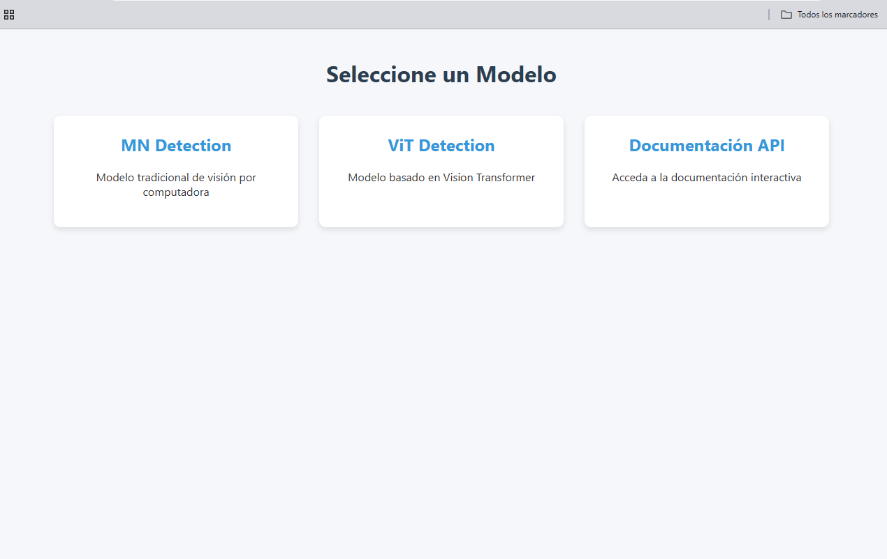
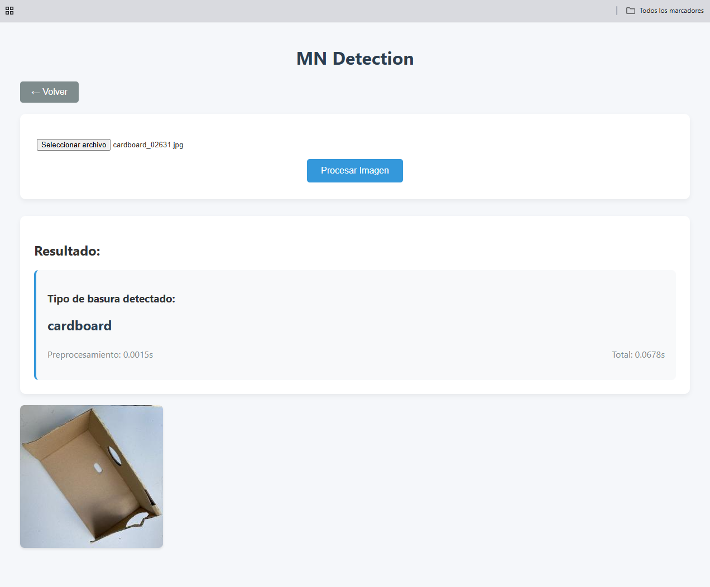
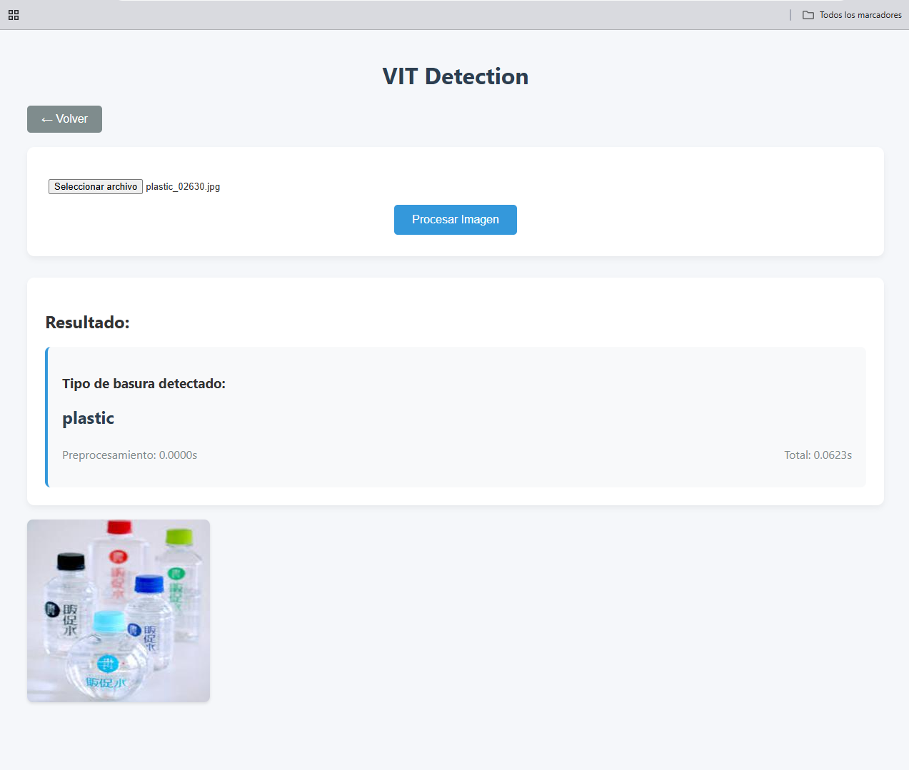

# 🚀 Trash Detection with AI Models

Project implementing two AI models (MobileNet and VisionTransformer) for classifying types of trash through images, with a web interface built using FastAPI.

## 🌟 Main Features

- **Two detection models**:
  - MobileNet model (MN)
  - Vision Transformer model (ViT)
- **REST API** with FastAPI
- **Interactive web interface**
- **Automatic documentation** (Swagger UI)
- **Real-time processing** with timing metrics

## 📸 Examples

<p align="center">
  
</p>

<p align="center" float="left">
  
  
</p>

## 🛠️ Technologies Used


## 📦 Installation

1. Clone the repository:
```bash
git clone https://github.com/your-username/your-repo.git
cd your-repo
```
2. Create and activate a virtual environment
- On Windows
```bash
python -m venv venv
venv\Scripts\activate
```
- On Linux/Mac
```bash
python -m venv venv
source venv/bin/activate
```
3. Install the dependencies
```bash
pip install -r requirements.txt
```
4. 🚀 Launch your server
```bash
uvicorn main:app --reload
```
## 🌐 Access the App

Once the server is running, you can access the following from your browser:

### 🖥️ Web Interface

[http://localhost:8000](http://localhost:8000)

### 📚 API Documentation (Swagger UI)

[http://localhost:8000/docs](http://localhost:8000/docs)

## 🖥️ Usage

### 🌍 Web Interface

1. Select the desired model (MV or ViT).
2. Upload an image.
3. View the classification results and prediction time.

## 📊 Performance

| Model | Parameters (M) | Accuracy | Top 2 Accuracy | 
|-------|----------------|----------|----------------|
| MN    | 5.4            | 80%      | 90%            |
| ViT   | 86             | 84%      | 93%            |
